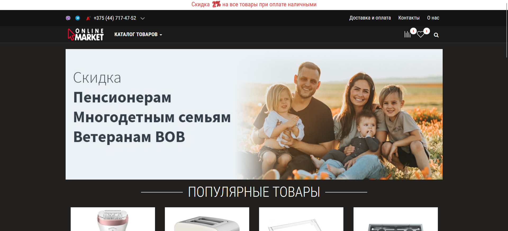
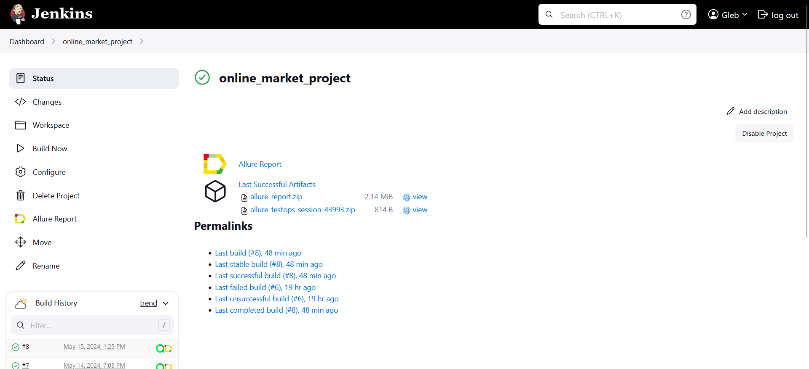
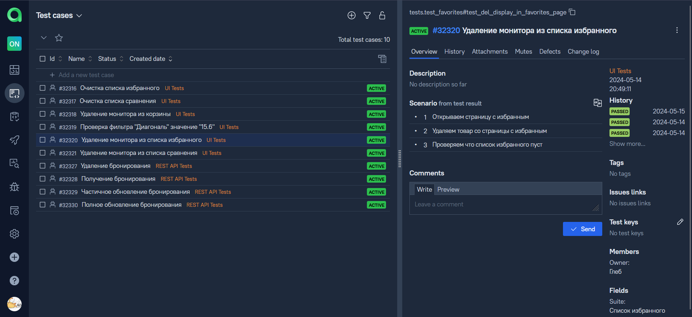
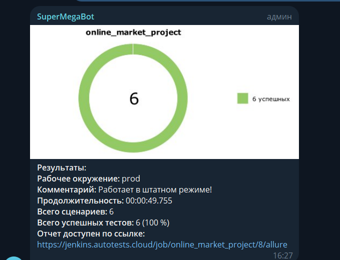
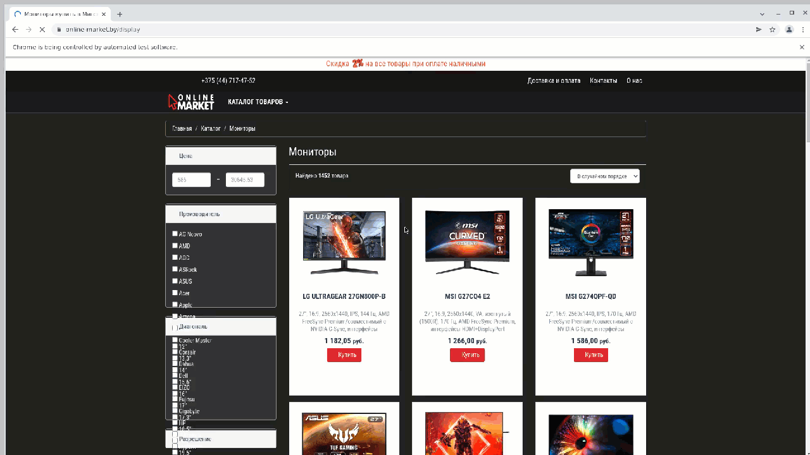

# Проект по тестированию интернет-магазина <a target="_blank" href="https://www.online-market.by/">Online-Market</a>

---
### Список проверок, реализованных в web автотестах
1. Открытие первого монитора в списке.
2. Проверка фильтра "Диагональ" значение "15.6".
3. Добавление монитора в корзину.
4. Удаление монитора из корзины.
5. Добавление монитора в список сравнения.
6. Удаление монитора из списка сравнение.
7. Очистка списка сравнения.
8. Добавление монитора в избранное.
9. Удаление монитора из избранного.
10. Очистка списка избранного.

---

### Используемые инструменты
         

---

### Запуск автотестов осуществляется с использованием Jenkins
> [Ссылка на сборку в Jenkins](https://jenkins.autotests.cloud/job/online_market_project/)

#### Для запуска автотестов в Jenkins
1. Открыть [задачу в Jenkins](https://jenkins.autotests.cloud/job/online_market_project/)

2. Нажать "**Build Now**".

---

### Интеграция с Allure TestOps

> [Тест-кейсы](https://allure.autotests.cloud/project/4236/test-cases/32320?treeId=0)

---

### Уведомления в Телеграм

---

### Прохождение автотеста

